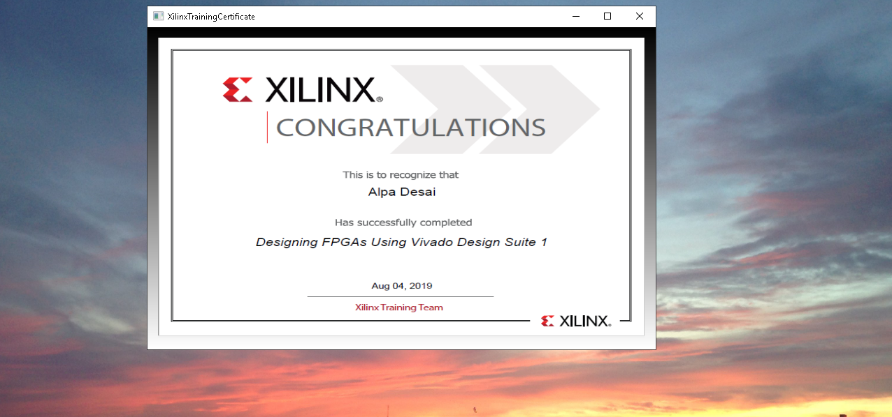

# System Verilog

The project provides an introduction to system level verification. Confidential information is not displayed. Please download the executable in https://github.com/alpaddesai/SystemVerilog/releases for details. All images are either custom by Alpa D Desai or a reference name is included. Most of the images are custom. Copyright protection is in process.

## Formal Verification

