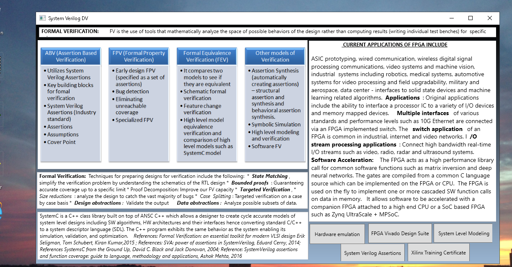
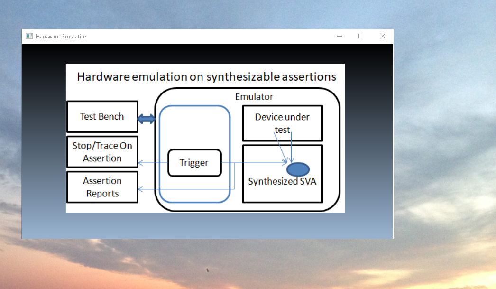
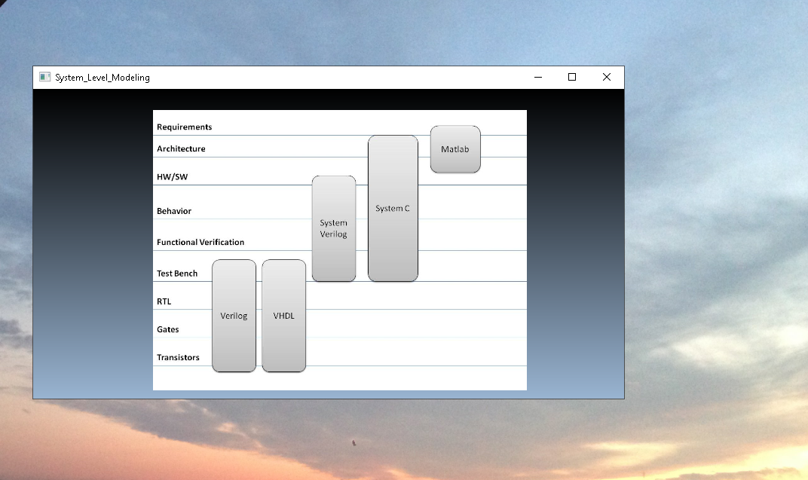
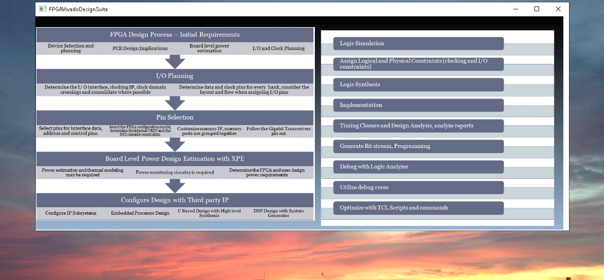
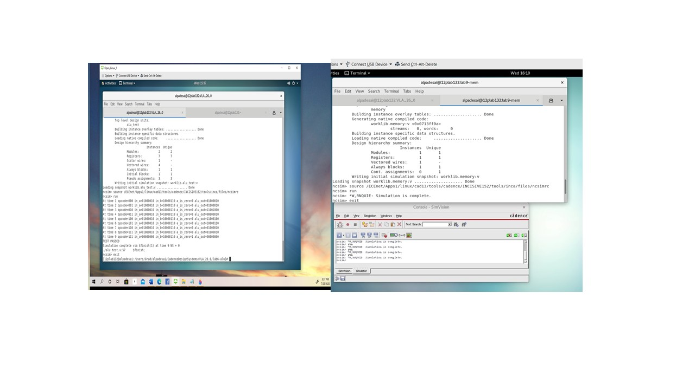
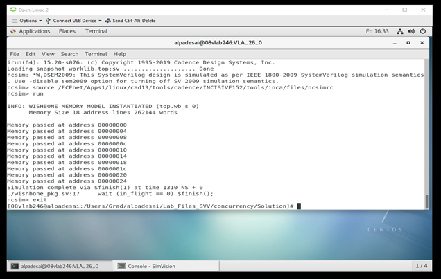

# System Verilog 

The project provides an introduction to system level verification. Confidential information is not displayed. Please download the executable in https://github.com/alpaddesai/SystemVerilog/releases for details.  All images are either custom by Alpa D Desai or a reference name is included. Most of the images are custom. 

## Formal Verification

## Cadence System Verilog 

## Images of examples from the certification

## Cadence Incisive 15.2

## Cadence System Verilog Assertions

## Algorithms

## Ethics and Integrity

Additional details please reference : https://github.com/alpaddesai/EmbeddedProgramming
